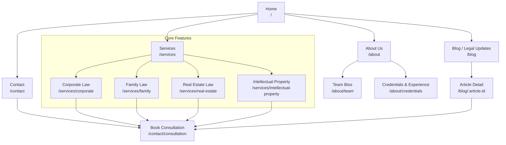

# User Flow — Law Firm Website

```mermaid
graph TD
  %% Primary Pages
  Home["Home<br/>/"]
  About["About Us<br/>/about"]
  Services["Services<br/>/services"]
  Blog["Blog / Legal Updates<br/>/blog"]
  Contact["Contact<br/>/contact"]

  %% Home Page Connections
  Home --> About
  Home --> Services
  Home --> Blog
  Home --> Contact

  %% Services Detail Pages
  subgraph "Core Features"
    Services --> Corporate["Corporate Law<br/>/services/corporate"]
    Services --> Family["Family Law<br/>/services/family"]
    Services --> RealEstate["Real Estate Law<br/>/services/real-estate"]
    Services --> IP["Intellectual Property<br/>/services/intellectual-property"]
  end

  %% About Sub-pages
  About --> TeamBios["Team Bios<br/>/about/team"]
  About --> Credentials["Credentials & Experience<br/>/about/credentials"]

  %% Blog Flow
  Blog --> Article["Article Detail<br/>/blog/:article-id"]

  %% Contact & Consultation Flow
  Contact --> BookConsultation["Book Consultation<br/>/contact/consultation"]

  %% Cross-page Navigation
  Corporate --> BookConsultation
  Family --> BookConsultation
  RealEstate --> BookConsultation
  IP --> BookConsultation
  Article --> BookConsultation
```
